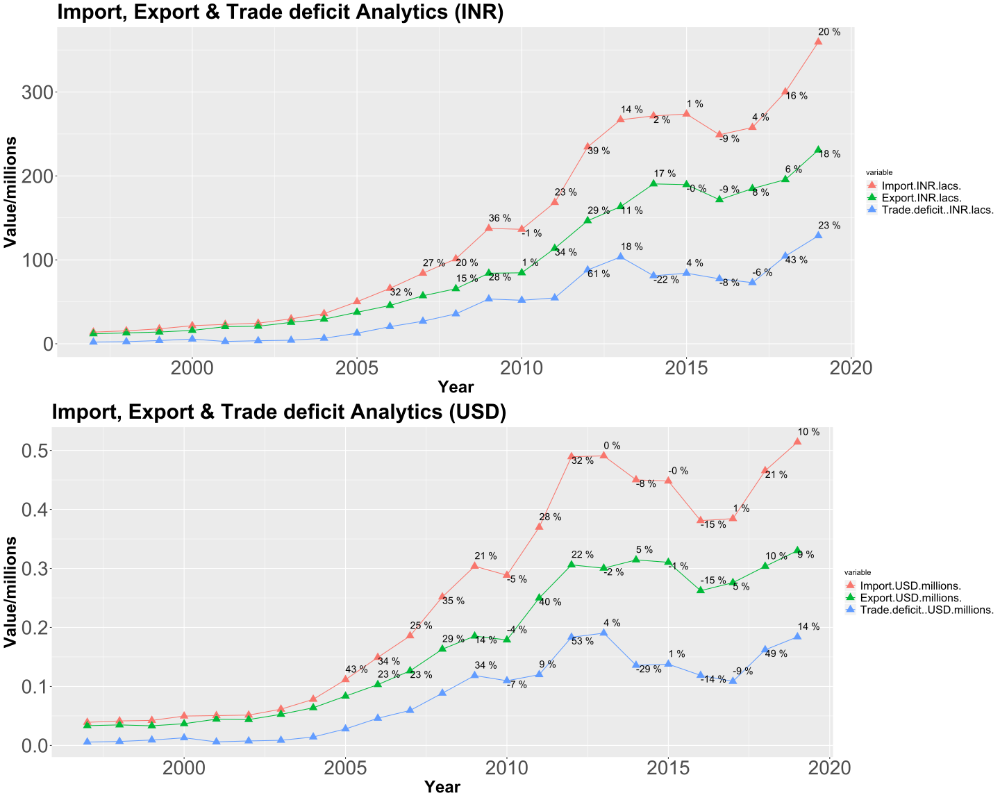
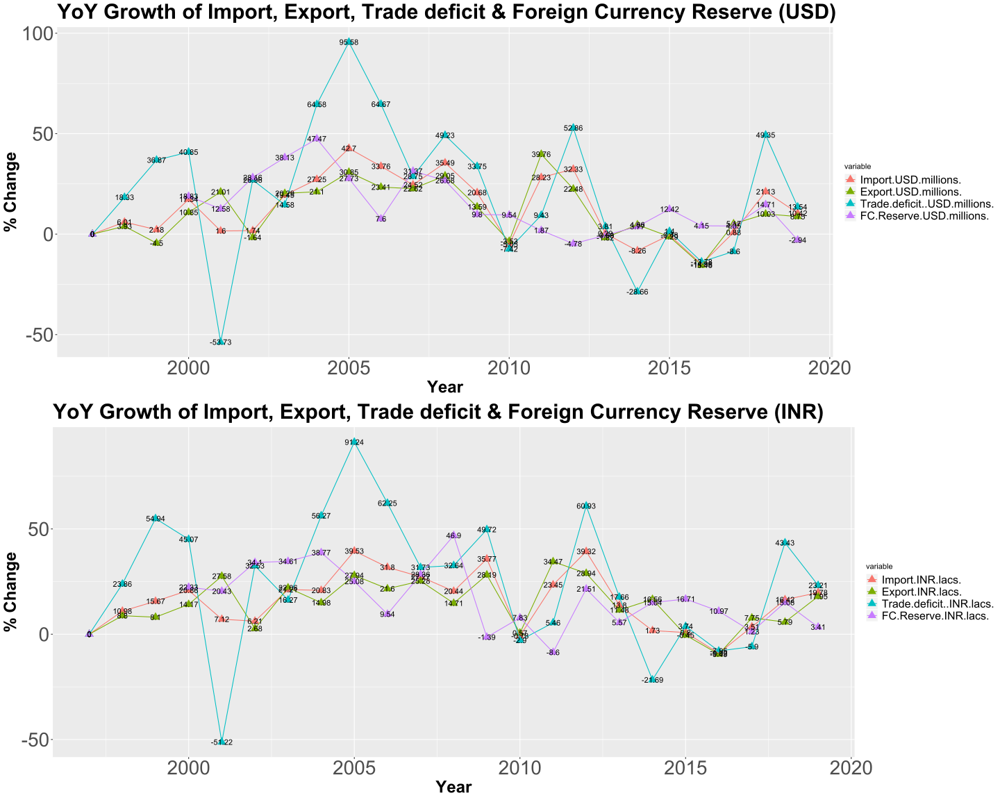

Introduction
------------

The objective of this analysis is to measure the impact on Import/Export
value due to change in various factors like GDP, Exchange rate (currency
inflation), inflation, trade policies, foreign currency reserves,
demand, trade deficit, countries current account, quality, productivity
& labor cost.

Out of all variables we have taken the below variables for which we have
measurable data

-   Exchange rate
-   Trade deficit
-   Foreign currency reserve

Date source for this analysis  
<a href="https://commerce.gov.in/" class="uri">https://commerce.gov.in/</a>  
<a href="https://m.rbi.org.in/" class="uri">https://m.rbi.org.in/</a>

The values are in various sub-pages of the above-mentioned websites and
we have manually copied the values of below said data variables into a
\*.CSV file. This file can be downloaded from
<a href="https://indiaelectiondata.in/datas/import_export.csv" class="uri">https://indiaelectiondata.in/datas/import_export.csv</a>

### Data Variables:

Data for this analysis has below variables

-   Year - End of financial year - Example the year 1998 represents the
    financial year of 1997-98
-   Import.INR.lacs. - Total import value in “lacs INR”
-   Import.USD.millions. - Total import value in “million USD”
-   Export.INR.lacs. - Total Export value in “lacs INR”
-   Export.USD.millions. - Total export value in “million USD”
-   Exchange.rate - Exchange rate (Calculated based on export INR & USD
    values)
-   Trade.deficit.INR.lacs. - Import less export in “lacs INR”
    (Calculated as import less export)
-   Trade.deficit.USD.millions. - Import less export in “million USD”
    (Calculated as import less export)
-   FC.Reserve.INR.lacs. - Foreign currency reserve in “lacs INR”
-   FC.Reserve.USD.millions. - Foreign currency reserve in “million USD”

All above USD & INR values are reported values in current price.

### Analysis 1: Representation of Import, Export & Trade Deficit

The below chart is a representation of import, export & trade deficit in
a single line chart. We have a separate chart for INR & USD values. The
percentage values are the “positive growth”/“negative growth” from the
previous year’s value.

-   The change in Import and Export values are directly proportional.
-   But the trade deficit increases or decreases along with
    import/export values.
-   Except for a few instances, the change in “positive
    growth”/“negative growth” is always higher in USD, when compared to
    INR. It tells the USD is more sensitive than INR.
-   The first drop occurred after 2009 and it was recovered within one
    year.
-   The second drop occurred around 2013 and it started recovering
    from 2018.
-   Also there was a stagnation of import & export from the year 2013
    to 2017.

``` r
    library(reshape2)
    library(ggplot2)
    library(cowplot)
```

    ## 
    ## ********************************************************

    ## Note: As of version 1.0.0, cowplot does not change the

    ##   default ggplot2 theme anymore. To recover the previous

    ##   behavior, execute:
    ##   theme_set(theme_cowplot())

    ## ********************************************************

``` r
    library(dplyr)
```

    ## 
    ## Attaching package: 'dplyr'

    ## The following objects are masked from 'package:stats':
    ## 
    ##     filter, lag

    ## The following objects are masked from 'package:base':
    ## 
    ##     intersect, setdiff, setequal, union

``` r
    import_export <- read.csv("import_export.csv", stringsAsFactors =FALSE)
    import_export_melt <- melt(import_export, id=c("Year","Exchange.rate"))
    import_export_melt$value <- import_export_melt$value/1000000
    USD_data <- import_export_melt[grep("USD", import_export_melt$variable), ]
    USD_data_growth <- USD_data
    for(i in 1:nrow(USD_data)){
        if(USD_data$Year[i]==1997){USD_data$Percent_Change[i] <- 0}
        else{USD_data$Percent_Change[i] <- sprintf("%.0f %%", 100*((USD_data$value[i] - USD_data$value[i-1]) / USD_data$value[i-1]))}
    }
    USD_data$vj <- rep(c(-1,1), length.out=nrow(USD_data))
    INR_data <- import_export_melt[grep("INR", import_export_melt$variable), ]
    INR_data_growth <- INR_data
    for(i in 1:nrow(INR_data)){
        if(INR_data$Year[i]==1997){INR_data$Percent_Change[i] <- 0}
        else{INR_data$Percent_Change[i] <- sprintf("%.0f %%", 100*((INR_data$value[i] - INR_data$value[i-1]) / INR_data$value[i-1]))}
    }
    INR_data$vj <- rep(c(-1,1), length.out=nrow(INR_data))
```

``` r
    plot_theme <- theme(axis.text=element_text(size=28), axis.title = element_text(size = 24,face = "bold"), plot.title = element_text(size=30, face = "bold"), legend.text = element_text(size = 16))

    USD_data_td <- filter(USD_data, variable != "FC.Reserve.USD.millions.")

    USD_plot_td <- ggplot(USD_data_td, aes(Year, value))+ geom_point(size=4, pch=17, aes(color=variable))+ geom_line(aes( color = USD_data_td$variable))+ labs(x="Year", y="Value/millions", title="Import, Export & Trade deficit Analytics (USD)")+ geom_text(aes(label = ifelse(USD_data_td$value > 0.1, as.character(USD_data_td$Percent_Change), '')), hjust = 0, vjust = USD_data_td$vj, size = 5)+ plot_theme
    
    INR_data_td <- filter(INR_data, variable != "FC.Reserve.INR.lacs.")
    
    INR_plot_td <- ggplot(INR_data_td, aes(Year, value))+ geom_point(size=4, pch=17, aes(color=variable))+ geom_line(aes( color = INR_data_td$variable))+ labs(x="Year", y="Value/millions", title="Import, Export & Trade deficit Analytics (INR)")+ geom_text(aes(label = ifelse(INR_data_td$value > 60, as.character(INR_data_td$Percent_Change), '')), hjust = 0, vjust = INR_data_td$vj, size=5)+ plot_theme
    plot_grid(INR_plot_td, USD_plot_td, nrow = 2)
```



### Analysis 2: Import & Export against Exchange rate

The below chart shows the import & export in USD & INR against the
exchange rate. All other variables affecting import & export were
assumed unchanged. Practically this situation is not feasible.

-   Since the data points are scattered, we have added a linear
    regression model to each chart.
-   The linear model line clearly shows that the import & export are
    directly proportional to the exchange rate.

``` r
    INR_data_exch <- filter(INR_data, variable != "FC.Reserve.INR.lacs.", variable != "Trade.deficit..INR.lacs.")

    INR_plot_exchange_rate <- ggplot(INR_data_exch, aes(INR_data_exch$Exchange.rate, value))+geom_point(aes(color=INR_data_exch$variable), size = 4 )+ facet_grid(.~INR_data_exch$variable) + geom_smooth(method = "lm", color="black")+labs(x = "Exchange Rate", y = "Value/millions", title = "Import & Export against Exchange Rate (INR)") + plot_theme
    
    USD_data_exch <- filter(USD_data, variable != "FC.Reserve.USD.millions.", variable != "Trade.deficit..USD.millions.")
    
    USD_plot_exchange_rate <- ggplot(USD_data_exch, aes(USD_data_exch$Exchange.rate, value))+geom_point(aes(color=USD_data_exch$variable), size = 4)+ facet_grid(.~USD_data_exch$variable)+ geom_smooth(method = "lm", color="black")+labs(x = "Exchange Rate", y = "Value/millions", title = "Import & Export against Exchange Rate (USD)") + plot_theme
    plot_grid(INR_plot_exchange_rate, USD_plot_exchange_rate, nrow = 2)
```


### Analysis 3: Import, Export & Foreign Currency Reserve

The below chart shows the import, export & foreign curremcy reserve in
USD & INR against the year. All other variables affecting import &
export were assumed unchanged.

-   The “positive/negative growth” is USD is mostly higher than INR.
-   The INR chart shows a growth for the year 2013 & 2014, which is flat
    in USD chart. Currency inflation could be a reason for this.
-   Also there was a stagnation of foreign currency reserve from the
    year 2012 and it started recovering from the year 2017.

``` r
    INR_data_FCreserve <- filter(INR_data, variable != "Trade.deficit..INR.lacs.")

    INR_plot_FCreserve <- ggplot(INR_data_FCreserve, aes(Year, value))+ geom_point(size=4, pch=17, aes(color=variable), na.rm = TRUE)+ geom_line(aes( color = INR_data_FCreserve$variable), na.rm = TRUE)+ labs(x="Year", y="Value/millions", title="Import, Export & Trade deficit Analytics (INR)")+ geom_text(aes(label = ifelse(INR_data_FCreserve$value > 60, as.character(INR_data_FCreserve$Percent_Change), '')), hjust = 0, vjust = INR_data_FCreserve$vj, size=5, na.rm = TRUE)+ plot_theme
    
    USD_data_FCreserve <- filter(USD_data, variable != "Trade.deficit..USD.millions.")
    
    USD_plot_FCreserve <- ggplot(USD_data_FCreserve, aes(Year, value))+ geom_point(size=4, pch=17, aes(color=variable), na.rm = TRUE)+ geom_line(aes( color = USD_data_FCreserve$variable), na.rm = TRUE)+ labs(x="Year", y="Value/millions", title="Import, Export & Trade deficit Analytics (USD)")+ geom_text(aes(label = ifelse(USD_data_FCreserve$value > 0.1, as.character(USD_data_FCreserve$Percent_Change), '')), hjust = 0, vjust = USD_data_FCreserve$vj, size = 5, na.rm = TRUE)+ plot_theme
    
    plot_grid(INR_plot_FCreserve, USD_plot_FCreserve, nrow = 2)
```


### Analysis 4: Year on Year (YoY) Percentage growth of Import, Export, Trade deficit & Foreign currency reserve

The below chart shows positive/negative growth of import, export, trade
deficit & foreign currency reserve in USD & INR.

Even though both INR & USD charts look the same, the below findings
arrived from the USD chart.

-   When import grows more than export, then the sensitivity of the
    increase in trade deficit is more. Similarly when the import drops
    more than export, then the sensitivity of the decrease in trade
    deficit is more.
-   All variable were having negative/positive growth together for 7
    years out of 19 years (from 2001 to 2019).
-   Always import & export drops when foreign currency reserve drops in
    the previous year, except 2011 & 2012, 2017 & 2018. But this
    exception may be due to the huge fall in 2010, 2013 & 2019.

``` r
  for(i in 1:nrow(USD_data_growth)){
    if(USD_data_growth$Year[i]==1997){USD_data_growth$Percent_Change[i] <- 0}
    else{USD_data_growth$Percent_Change[i] <- round(100*((USD_data_growth$value[i] - USD_data_growth$value[i-1]) / USD_data_growth$value[i-1]), digits = 2)}
  }
  USD_data_growth$vj <- rep(c(-1,1), length.out=nrow(USD_data_growth))
  
  for(i in 1:nrow(INR_data_growth)){
    if(INR_data_growth$Year[i]==1997){INR_data_growth$Percent_Change[i] <- 0}
    else{INR_data_growth$Percent_Change[i] <- round(100*((INR_data_growth$value[i] - INR_data_growth$value[i-1]) / INR_data_growth$value[i-1]), digits = 2)}
  }
  INR_data_growth$vj <- rep(c(-1,1), length.out=nrow(INR_data_growth))
```

``` r
  USD_plot_growth <- ggplot(USD_data_growth, aes(Year, Percent_Change))+ geom_point(size=4, pch=17, aes(color=variable), na.rm = TRUE)+ geom_line(aes( color = USD_data_growth$variable))+ labs(x="Year", y="% Change", title="YoY Growth of Import, Export, Trade deficit & Foreign Currency Reserve (USD)")+ geom_text(aes(label = USD_data_growth$Percent_Change), na.rm = TRUE)+ plot_theme
  
  INR_plot_growth <- ggplot(INR_data_growth, aes(Year, Percent_Change))+ geom_point(size=4, pch=17, aes(color=variable), na.rm = TRUE)+ geom_line(aes( color = INR_data_growth$variable))+ labs(x="Year", y="% Change", title="YoY Growth of Import, Export, Trade deficit & Foreign Currency Reserve (INR)")+ geom_text(aes(label = INR_data_growth$Percent_Change), na.rm = TRUE)+ plot_theme
  
  plot_grid(USD_plot_growth, INR_plot_growth, nrow = 2)
```


